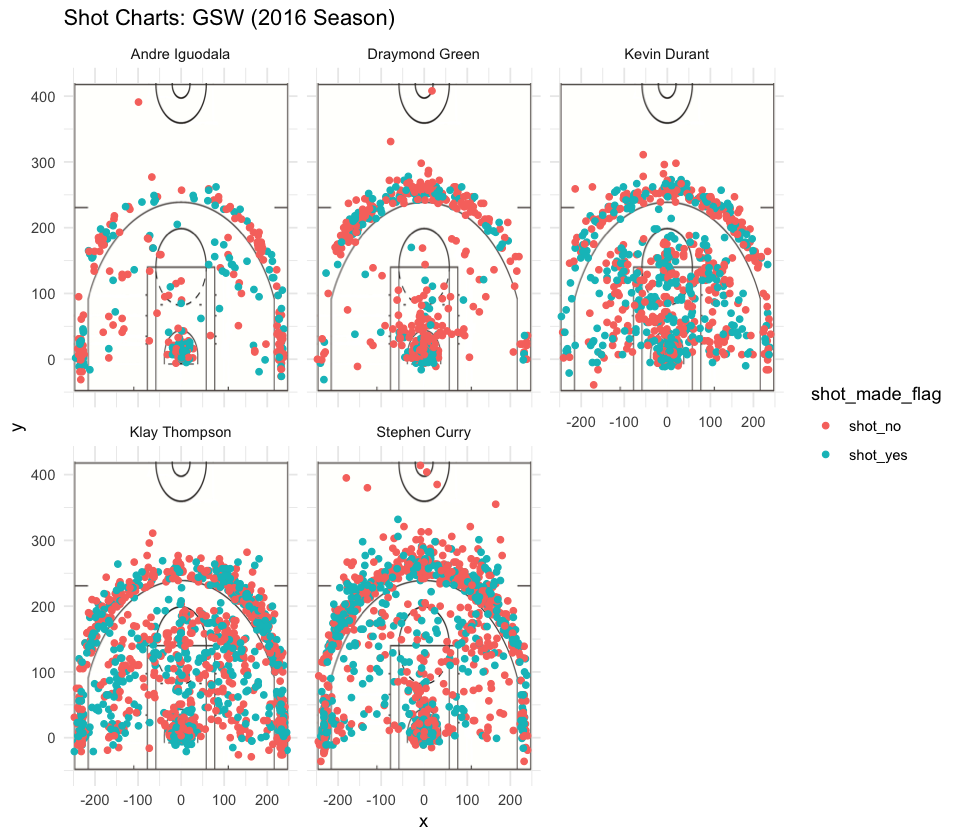

Workout 1
================
Alan Xu

The Golden State Warrior Death Lineup: Determining the Best Shooter
===================================================================

Introduction
------------

With the addition of Kevin Durant in the 2016 NBA Season, the Golden State Warriors became widely regarded as the the league's strongest team, with three star players in Steph Curry, Klay Thompson, and Kevin Durant. With so many star players, Coach Steve Kerr has the luxury of staggering those star players, however in close 4th quarters at the end of the game, Steve Kerr tends a play a so called "Death Lineup" of Curry, Thompson, Durant, DPOY Draymond Green and 6th-man Andre Iguodala. This lineup is known for the main 3's potent offensive power, while Green and Iguodala provide lockdown defense and spot up shooting to help space the floor.

Curry and Thompson are often referred to as "generational shooters" and Kevin Durant is also regarded as one of the league's strongest offensive weapons. Iguodala and Green are also capable shooters, if not great, in order to space the floor. We seek to investigate how exactly Golden State's big 3 differ in their shooting ability, as well as how Iguodala and Green fit into the offensive scheme, by investigating each player's shooting data from in the 2016-2017 season.

Data
----

First, let's show some sample rows for the dataset that we're working with. As you can see, it has a list of every attempted shot by the aforementioned five players. The main data that we're working with from this set is the type of shot, the player who attempted the shot, as well as the shot result.

|    X| team\_name            | game\_date |  season|  period|  minutes\_remaining|  seconds\_remaining| shot\_made\_flag | action\_type                   | shot\_type     |  shot\_distance| opponent               |    x|    y| name          |  minute|
|----:|:----------------------|:-----------|-------:|-------:|-------------------:|-------------------:|:-----------------|:-------------------------------|:---------------|---------------:|:-----------------------|----:|----:|:--------------|-------:|
|    1| Golden State Warriors | 12/15/16   |    2016|       3|                   3|                  51| shot\_yes        | Cutting Finger Roll Layup Shot | 2PT Field Goal |               3| New York Knicks        |   25|   21| Stephen Curry |      33|
|    2| Golden State Warriors | 10/28/16   |    2016|       3|                   9|                  14| shot\_yes        | Cutting Finger Roll Layup Shot | 2PT Field Goal |               2| New Orleans Pelicans   |    9|   26| Stephen Curry |      27|
|    3| Golden State Warriors | 11/1/16    |    2016|       2|                   5|                   8| shot\_yes        | Cutting Finger Roll Layup Shot | 2PT Field Goal |               2| Portland Trail Blazers |  -22|    2| Stephen Curry |      19|
|    4| Golden State Warriors | 12/1/16    |    2016|       3|                   5|                  27| shot\_yes        | Cutting Finger Roll Layup Shot | 2PT Field Goal |               0| Houston Rockets        |    2|    7| Stephen Curry |      31|
|    5| Golden State Warriors | 4/4/17     |    2016|       3|                   2|                   4| shot\_yes        | Cutting Finger Roll Layup Shot | 2PT Field Goal |               2| Minnesota Timberwolves |    1|   26| Stephen Curry |      34|
|    6| Golden State Warriors | 11/19/16   |    2016|       4|                   5|                  36| shot\_yes        | Cutting Finger Roll Layup Shot | 2PT Field Goal |               0| Milwaukee Bucks        |    2|    7| Stephen Curry |      43|

Analysis
--------

With a few data transformations, we can generate the shooting percentage of the Death Lineup. Below we have the effective two point percentage, three point percentage, as well total percentage (ordered by descending net percentage).

#### Effective Two Point Percentage Shooting

| name           |  total|  made|  percentage|
|:---------------|------:|-----:|-----------:|
| Andre Iguodala |    210|   134|   0.6380952|
| Kevin Durant   |    643|   390|   0.6065319|
| Stephen Curry  |    563|   304|   0.5399645|
| Klay Thompson  |    640|   329|   0.5140625|
| Draymond Green |    346|   171|   0.4942197|

#### Effective Three Point Percentage Shooting

| name           |  total|  made|  percentage|
|:---------------|------:|-----:|-----------:|
| Klay Thompson  |    580|   246|   0.4241379|
| Stephen Curry  |    687|   280|   0.4075691|
| Kevin Durant   |    272|   105|   0.3860294|
| Andre Iguodala |    161|    58|   0.3602484|
| Draymond Green |    232|    74|   0.3189655|

#### Effective Total Shooting Percentage

| name           |  total|  made|  percentage|
|:---------------|------:|-----:|-----------:|
| Kevin Durant   |    915|   495|   0.5409836|
| Andre Iguodala |    371|   192|   0.5175202|
| Klay Thompson  |   1220|   575|   0.4713115|
| Stephen Curry  |   1250|   584|   0.4672000|
| Draymond Green |    578|   245|   0.4238754|

Taking a look at these resulting tables, we see some inconsistencies with the overall narrative that was established before. Andre Iguodala, who is known for being a flexible defender and game finisher instead of being a sharpshooter, leads the Death Lineup in 2-pt shooting percentage. Steph Curry, the greatest shooter in the game of basketball, doesn't lead any category of shooting percentage at all, including being fourth in effective total shooting percentage. Klay Thompson, also consisntely listed in the top 5 shooters in NBA history, is only third in this lineup of five for effective total shooting percentage as well. Are basketball experts just completely deluded, or is our dataset and filtering incorrect somehow?

The answer is actually *neither*. Our analysis is incomplete! In other words, focusing on only the total computed percentage paints an incomplete picture of each player's season.

Let's focus on effective total shooting percentage for now (here is the table again for reference).

### Effective Total Shooting Percentage

| name           |  total|  made|  percentage|
|:---------------|------:|-----:|-----------:|
| Stephen Curry  |   1250|   584|   0.4672000|
| Klay Thompson  |   1220|   575|   0.4713115|
| Kevin Durant   |    915|   495|   0.5409836|
| Draymond Green |    578|   245|   0.4238754|
| Andre Iguodala |    371|   192|   0.5175202|

This time however, we no longer order by the effective shooting percentage in descending order. Instead, we're using the total number of made shots in the 2016-2017 season. Now we see that Curry, Thompson, and Durant top the death lineup as what might be expected. Our table includes the actual number of made shots as well, so let's look at them per player.

Curry and Thompson took **1250** and **1220** shots in the 2016-2017 NBA Season. The Warrior's third offensive weapon, Kevin Durant wasn't far behind at **915** shots. They made 584, 575, and 495 shots total respectively. In contrast, Iguodala and Green have less than half of those shot attempts and makes, clearly showing that their offensive production is no where near comparable levels. This points to a sample size issue in our earlier conclusions about shooting skill. Iguodala, for example, is second in effective shooting percentage. If he took 1000 more shots during the season, it seems likely that his shooting percentage may drop as well.

How else might Curry, Thompson, and Durant be effective shooters in the way that their percentage doesn't necessarily represent? For anyone that is familiar with playing the game of basketball itself, the natural answer is shooting difficulty. Curry and Durant are known for their ability to shoot from anywhere on the floor and create their own shot, despite being guarded tightly or even double-teamed by opposing defenders at times. Thompson is also known for his extremely rapid catch and release, which allows him to be one of the league's most effective off-ball weapons.

While we don't have any data about how closely guarded or contested each player's shot was in our dataset, we do have the coordinates of each shot. We visualize all 5 Death Lineup player's shooting charts below.

As we can see, our three main shooters have a variety of shots attempted and made all over the court. Some smaller patterns include: Kevin Durant appears to be more effective from the left corner/side as opposed to the right corner/side, Klay Thompson has relatively (slightly) less shots attempted from within the paint, and Steph not only appears to take shots several feet behind the three-point line, he also *makes them at a decent rate* (from a quick visual scan).

Now examining Green and Iguodala's shooting charts, we see that Green prefers to take three point shots directly from the middle of the arc and rarely takes mid range jumpers. Iguodala has somewhat more spread out of a shot chart and even sometimes takes extremely far shots (although he doesn't make them, so most likely end of quarter heaves). We also see another misconception in our previous shooting percentage conclusions. Some of the shots are suspiciously close to the basket itself, and we now realize that lay-ups and dunks are also included our data. While these are field goals, layups and dunks are not typically not considered a prototypical shot attempt. We may want to filter any layups and dunks out in the future, and see how that affects the shooting percentage.

Conclusion
----------

The Golden State Warriors have three very potent offensive players in Steph Curry, Klay Thompson and Kevin Durant. In our original analysis, we found the Death Lineup's shooting percentages for the entire 2016-2017 season: two-pt, three-pt, and total. Our results pointed towards players like Curry and Thompson not even being the most effective shooters on their team. However, further investigation into shot volume as well as shot placement reveals that GSW's big three are indeed the top shooters of the league right now.
